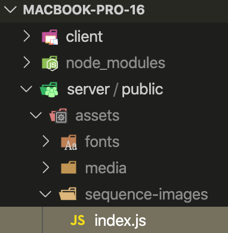

# MacBook Pro 16-inch (Landing Page Clone)

Cloning challenge to practice recreating Apple's MacBook Pro 16-inch landing page.

## Technologies Used

- React.js
- ScrollMagic
- Bootstrap 4
- HTML5
- CSS3
- Webpack 4

## Clone Template


## Development

#### System Requirements

- Git Version Control System
- Node.js 10 or higher
- NPM 6 or higher

#### Getting Started

1. Clone the repository.

    ```shell
    git clone https://github.com/juliehchung/macbook-pro-16.git
    cd macbook-pro-16
    ```

2. Install all dependencies with NPM.

    ```shell
    npm install
    ```

3. Directory containing `assets` can be obtained at the following link:
    - https://drive.google.com/open?id=1WPqctS7biVJHvIaPWtak-gLTy9EwhSDs

4. Add provided `assets` to `/public`. Make sure the filepath correctly reads `/server/public/assets` like the image below:

    
    - Note: There is an `index.js` file located in `sequence-images`, and this should **NOT** be left out!

5. Start the project.

    ```shell
    npm run dev
    ```

6. Once started you can view the application by opening `http://localhost:3000` in your browser.
